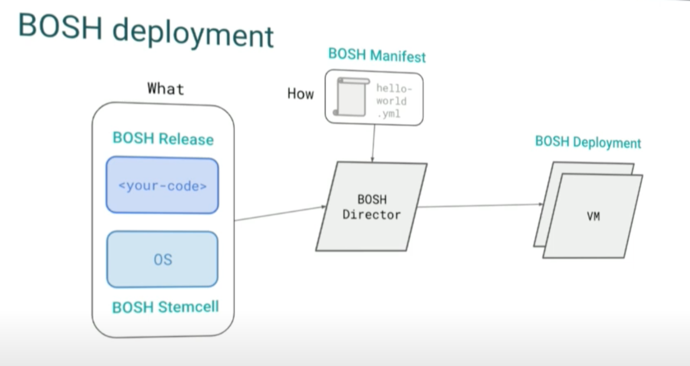

## Creating a release

### Building blocks


* Bosh manifest file
  Main manifest file that explains about the release. 
    - release name
    - Contains the description of the VM required. 
    

####
```shell script
cd <bosh release directory>

# Create a release
bosh create-release

# uploads to the bosh directory
bosh upload-release

# Deploy bosh 
bosh deploy

- Creates the VM
- installs the software and run job based on the configuration


```
